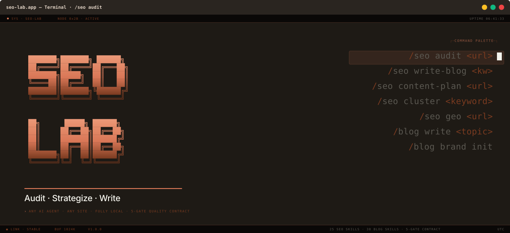

<div align="center">



</div>

---

<div align="center">

[](LICENSE)
[](https://www.python.org/)
[](https://claude.ai)
[](https://gemini.google.com)
[](https://www.linkedin.com/in/usamaalipk/)

</div>

---

## The Pipeline

```
         Any URL or Keyword
                 │
                 ▼
    ┌────────────────────┐      ┌────────────────────┐      ┌────────────────────┐
    │    🔍  Audit        │─────▶│   📅  Strategy      │─────▶│   ✍️  Content      │
    │                    │      │                    │      │                    │
    │  14 agents run     │      │  Topic clusters,   │      │  Research →        │
    │  in parallel.      │      │  keyword maps,     │      │  Write →           │
    │  Every dimension   │      │  90-day editorial  │      │  5-gate QA →       │
    │  of SEO covered.   │      │  calendar built    │      │  Ship ≥ 90/100     │
    │                    │      │  from audit data.  │      │                    │
    └────────────────────┘      └────────────────────┘      └────────────────────┘
                 │                                                     │
                 ▼                                                     ▼
       health-score.json                                    article.md + .html + .pdf
       fix-plan.md                                          preflight-report.json
       client-audit-report.html                             review.md (all gates passed)
```

---

## What You Get

<table>
<tr>
<td width="33%" valign="top">

### 🔍 Full Site Audit

Technical health, content quality, schema markup, Core Web Vitals, local SEO, AI search readiness, and backlinks — all analyzed in parallel by specialist agents.

Delivers a **scored health report**, a prioritized fix plan grouped by urgency, and an **interactive HTML dashboard** ready to hand to a client.

</td>
<td width="33%" valign="top">

### ✍️ Ranked Content

Brief → research → outline → write → quality-score → deliver. Every article goes through a **5-gate preflight** — structure, prose, visuals, SEO, and a minimum **90/100 quality score**.

Below threshold it rewrites itself — up to 3 iterations — before it ever reaches you.

</td>
<td width="33%" valign="top">

### 📅 Content Strategy

Turn one audit into a full content operation. Topic clusters, keyword opportunity maps, hub-and-spoke architecture, and a **90-day editorial calendar** — all built from your audit findings, not guesswork.

</td>
</tr>
<tr>
<td width="33%" valign="top">

### 🤖 Any AI Agent

Works with Claude, Gemini, GPT, or any future tool — through natural conversation, not locked slash commands. A shared state file tracks every session so any agent picks up exactly where the last one stopped.

</td>
<td width="33%" valign="top">

### 🔒 Fully Local

Everything runs on your machine. Client data never leaves. No subscriptions, no per-seat pricing. The system builds memory across sessions — client 10 benefits from everything learned on clients 1 through 9.

</td>
<td width="33%" valign="top">

### ⚡ One Command Setup

Clone, run `install.ps1`, and you're ready. Python venv, Playwright, and all dependencies handled automatically. When skill versions update, `update.ps1` syncs them without touching your data or config.

</td>
</tr>
</table>

---

## How You Work With It

SEO Lab is conversation-driven. You open the folder in your AI agent of choice, describe what you need, and the system handles the rest. No memorizing syntax. No switching tools.

**Audit a site**
> "Audit https://example.com and tell me what's hurting its rankings most"

The agent reads the workflow, fetches the page once, runs all analysis in parallel, scores every category, and delivers a prioritized fix plan with an interactive HTML dashboard.

**Write content**
> "Write a blog post targeting 'best CRM for small business' — use the audit findings for context"

The agent researches 8–12 current statistics from Tier 1 sources, builds an outline, writes with E-E-A-T signals baked in, runs a 5-gate quality check, and delivers a complete article with rendered HTML and PDF. If the quality score is below 90/100, it rewrites — you never see a draft that hasn't passed.

**Build a strategy**
> "Build a 90-day content calendar from the audit findings"

The agent maps keyword gaps, groups topics into hub-and-spoke clusters, and produces a week-by-week editorial calendar ready to execute.

**Resume work**
> "What were we working on? Continue from where we left off."

The agent reads `.planning/STATE.md`, shows you the current phase, and picks up from the exact next step — whether that session was yesterday or three weeks ago, and whether it was you, Claude, or Gemini who left off last.

---

## Why SEO Lab Over claude-seo or claude-blog Alone

claude-seo and claude-blog are excellent standalone tools. SEO Lab is built on top of them — and adds the layer that makes them actually usable as a professional operation.

```
┌─────────────────────────────┬──────────────┬──────────────┬──────────────┐
│                             │  claude-seo  │  claude-blog │   SEO Lab    │
├─────────────────────────────┼──────────────┼──────────────┼──────────────┤
│ Works with any AI agent     │      ✗       │      ✗       │      ✅      │
│ (Claude, Gemini, GPT…)      │  Claude Code │  Claude Code │  Any tool    │
├─────────────────────────────┼──────────────┼──────────────┼──────────────┤
│ Audit → Content pipeline    │      ✗       │      ✗       │      ✅      │
│ (connected end-to-end)      │  audit only  │ content only │   unified    │
├─────────────────────────────┼──────────────┼──────────────┼──────────────┤
│ Cross-session memory        │      ✗       │      ✗       │      ✅      │
│ (knows what was done before)│  forgets     │  forgets     │  STATE.md    │
├─────────────────────────────┼──────────────┼──────────────┼──────────────┤
│ Cross-client learning       │      ✗       │      ✗       │      ✅      │
│ (patterns from past clients)│      —       │      —       │  JSONL store │
├─────────────────────────────┼──────────────┼──────────────┼──────────────┤
│ Conversation-first workflow │      ✗       │      ✗       │      ✅      │
│ (no slash commands needed)  │ slash cmds   │ slash cmds   │  plain prose │
├─────────────────────────────┼──────────────┼──────────────┼──────────────┤
│ Self-contained folder       │      ✗       │      ✗       │      ✅      │
│ (no global install needed)  │ ~/.claude/   │ ~/.claude/   │  repo only   │
├─────────────────────────────┼──────────────┼──────────────┼──────────────┤
│ Cost-aware model routing    │      ✗       │      ✗       │      ✅      │
│ (budget vs quality per task)│  one model   │  one model   │  tiered      │
├─────────────────────────────┼──────────────┼──────────────┼──────────────┤
│ Audit quality gate          │      ✗       │      ✅      │      ✅      │
│ (validates output before    │  no gate     │  blog only   │  audit +     │
│  scoring begins)            │              │              │  blog gates  │
└─────────────────────────────┴──────────────┴──────────────┴──────────────┘
```

---

## Get Started

```powershell
git clone https://github.com/UsamaAli-PK/SEO-LAB.git
cd SEO-LAB
.\install.ps1
```

Open your AI agent in this folder. It reads `.planning/STATE.md` first and tells you exactly where to begin.

---

## Keeping It Current

```powershell
.\update.ps1   # pulls latest skill versions — your data and config are never touched
```

---

<details>
<summary>Quick command reference (for Claude Code users)</summary>

**Audit:** `/seo audit <url>` · `/seo technical` · `/seo content` · `/seo schema` · `/seo local` · `/seo geo` · `/seo performance` · `/seo cluster <keyword>`

**Content:** `/seo write-blog <keyword>` · `/seo write-page <topic>` · `/seo content-plan <url>` · `/seo keyword-research <seed>` · `/blog brand init`

</details>

---

<div align="center">

Built by [Usama Ali](https://www.linkedin.com/in/usamaalipk/) &nbsp;·&nbsp; MIT License

Powered by [claude-seo](https://github.com/AgriciDaniel/claude-seo) and [claude-blog](https://github.com/AgriciDaniel/claude-blog)

</div>
